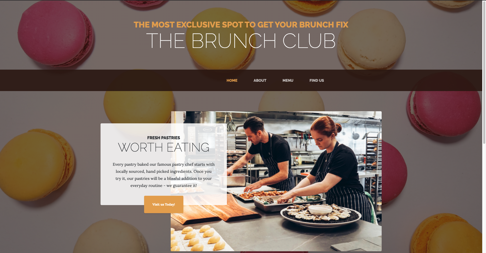

# restaurant-page-js

<!--
*** Thanks for checking out this README Template. If you have a suggestion that would
*** make this better, please fork the repo and create a pull request or simply open
*** an issue with the tag "enhancement".
*** Thanks again! Now go create something AMAZING! :D
-->

<!-- PROJECT SHIELDS -->
<!--
*** I'm using markdown "reference style" links for readability.
*** Reference links are enclosed in brackets [ ] instead of parentheses ( ).
*** See the bottom of this document for the declaration of the reference variables
*** for contributors-url, forks-url, etc. This is an optional, concise syntax you may use.
*** https://www.markdownguide.org/basic-syntax/#reference-style-links
-->
[![Contributors][contributors-shield]][contributors-url]
[![Forks][forks-shield]][forks-url]
[![Stargazers][stars-shield]][stars-url]
[![Issues][issues-shield]][issues-url]

https://github.com/BrittanyBlake/restaurant-page-js
<!-- PROJECT LOGO -->
 

  

  <h3 align="center">Restaurant Page</h3>

  

    This is the restaurant page project from the Odin project's Javascript curriculum
     
    <a href="https://github.com/BrittanyBlake/restaurant-page-js"><strong>Explore the docs »</strong></a>
     
     
    <a href="https://github.com/BrittanyBlake/restaurant-page-js/issues">Report Bug</a>
    ·
    <a href="https://github.com/BrittanyBlake/restaurant-page-js/issues">Request Feature</a>
  

<!-- TABLE OF CONTENTS -->
## Table of Contents

* [About the Project](#about-the-project)
  * [Built With](#built-with)
* [Contact](#Authors)
* [Acknowledgements](#acknowledgements)
* [How it works](#How-it-works)

<!-- ABOUT THE PROJECT -->
## About The Project

In this project, we were asked to build a Restaurant Page. This project is for practising DOM manipulation by dynamically rendering a simple restaurant homepage! We have just use JavaScript alone to generate the entire contents of the website.

## LIVE DEMO
 [Link to live demo](https://brunchclub.netlify.app/) 

<!-- BUILD WITH -->
## Built With
This project was built using these technologies.
* Javascript
* HTML
* CSS
* Bootstrap
* Webpack

<!-- ABOUT THE PROJECT -->
## Getting Started
- To get a local copy up and running follow these simple example steps.

#### Clone the repository to run the app.

- $ `git clone git@github.com:BrittanyBlake/restaurant-page-js`
- `cd` into the project directory
- Run `npm install` to install the necessary modules
- Run `npm start` to automatically load the page on localhost:8080

<!-- CONTACT -->
## Authors

👤 **Brittany Blake**

- Github: [@BrittanyBlake](https://github.com/BrittanyBlake)
- Twitter: [@bbcodes_](https://twitter.com/bbcodes_)
- Linkedin: [Brittany Blake](https://www.linkedin.com/in/brittany-blake-843951109/)

<!-- ACKNOWLEDGEMENTS -->
## Acknowledgements
* [Microverse](https://www.microverse.org/)
* [Design Template](https://github.com/StartBootstrap/startbootstrap-business-casual)

## Show your support

Give a ⭐️ if you like this project!

<!-- MARKDOWN LINKS & IMAGES -->
<!-- https://www.markdownguide.org/basic-syntax/#reference-style-links -->
[contributors-shield]: https://img.shields.io/github/contributors/BrittanyBlake/restaurant-page-js.svg?style=flat-square
[contributors-url]: https://github.com/BrittanyBlake/restaurant-page-js/graphs/contributors
[forks-shield]: https://img.shields.io/github/forks/BrittanyBlake/restaurant-page-js.svg?style=flat-square
[forks-url]: https://github.com/BrittanyBlake/restaurant-page-js/network/members
[stars-shield]: https://img.shields.io/github/stars/BrittanyBlake/restaurant-page-js?style=flat-square
[stars-url]: https://github.com/BrittanyBlake/restaurant-page-js/stargazers
[issues-shield]: https://img.shields.io/github/issues/BrittanyBlake/restaurant-page-js.svg?style=flat-square
[issues-url]: https://github.com/BrittanyBlake/restaurant-page-js/issues

## 📝 License

This project is [MIT](https://opensource.org/licenses/MIT) licensed. Design by Gregoire Vella on Behance.
